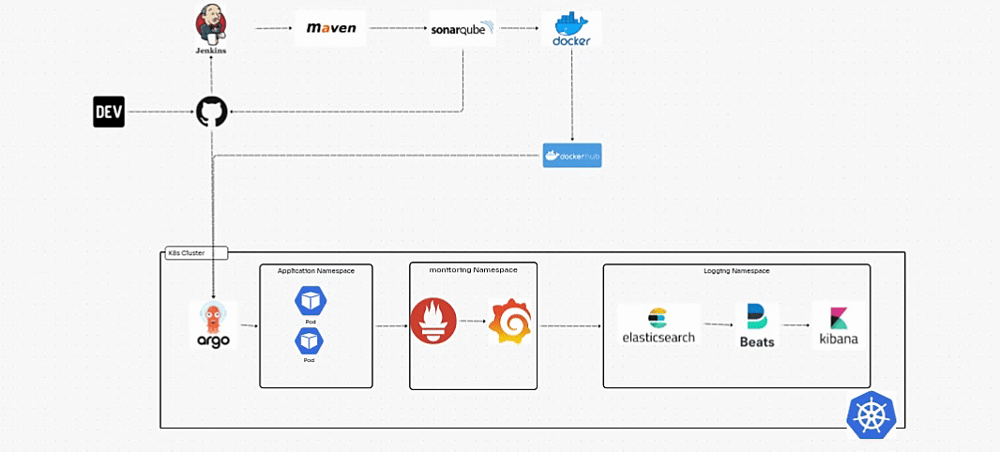

# DevOps CI/CD Pipeline Documentation

This project demonstrates the complete setup and integration of a comprehensive **DevOps CI/CD pipeline** designed for efficient software development and deployment. It utilizes a variety of tools and technologies, each playing a critical role in the pipeline, providing a fully automated, scalable, and reliable process from code integration to real-time monitoring.

- **Version Control:** GitHub
- **CI/CD Tools:** Jenkins
- **Build Tools:** Maven
- **Code Quality and Security:** SonarQube
- **Containerization:** Docker and DockerHub
- **Container Orchestration:** Kubernetes
- **Application Deployment:** ArgoCD and Helm
- **Monitoring and Logging:** Prometheus, Grafana, Filebeat, OpenSearch, and Kibana

Each section includes detailed explanations, configurations, and relevant screenshots.

---

## Prerequisites
Before proceeding, ensure the following tools are installed and configured:

- **Git** and a GitHub account
- **Docker** for containerization
- A **Kubernetes Cluster** (e.g., Minikube, kind, or a cloud-managed service such as EKS , GKE , AKS)
- **Jenkins** for CI/CD automation
- **Maven** for build automation
- **SonarQube** for code quality analysis
- **ArgoCD** for GitOps deployment
- **Helm** for Kubernetes package management
- **Prometheus** and **Grafana** for monitoring
- **Filebeat**, **OpenSearch**, and **Kibana** for logging and visualization

---

## Step-by-Step Guide

### 1. **Version Control with GitHub**
1. Create a repository on GitHub to store your application code and pipeline configurations.
2. Clone the repository to your local machine:

```bash
# Clone the repository locally
$ git clone https://github.com/Alien166/DevOps-CI-CD-Pipeline-From-Code-to-Monitoring.git
```
3. Add a sample Java project or any application code you wish to deploy.

### 2. **Setting up Jenkins**
1. Install Jenkins and required plugins: Maven, Git, Docker, and SonarQube.
2. Create a new Jenkins job:
   - Choose **Pipeline Project**.
   - Configure source code management to pull code from the GitHub repository.
   - Add build steps to execute Maven commands like `clean install`.
3. Configure Jenkins to interact with Docker and Kubernetes.

### 3. **Code Quality Analysis with SonarQube**
1. Set up a SonarQube server locally or use a cloud instance.
2. Integrate SonarQube with Jenkins:
   - Navigate to Jenkins settings and add SonarQube server details (URL and authentication token).
   - Update Jenkins pipeline to include SonarQube analysis steps.
3. Add a build step in Jenkins to run SonarQube analysis:

```bash
mvn sonar:sonar -Dsonar.projectKey=project-name \
  -Dsonar.host.url=http://sonarqube-server-url \
  -Dsonar.login=your-token
```

### 4. **Containerizing with Docker**
1. Create a `Dockerfile` in the project root directory:

```dockerfile
# Base image 
FROM openjdk

# setting artifact path
ARG artifact=target/demo-java-app.jar

WORKDIR /opt/app

COPY ${artifact} app.jar

# Entrypoint for running app
ENTRYPOINT ["java","-jar","app.jar"]
```
2. Build and push the Docker image:

```bash
# Build the Docker image
$ docker build -t username/app-name:tag .

# Push the image to DockerHub
$ docker push username/app-name:tag
```

### 5. **Deploying with ArgoCD and Helm**
1. Install and configure ArgoCD in your Kubernetes cluster with helm chart.
2. Create a Helm chart for the application deployment.
3. Connect the GitHub repository to ArgoCD for continuous deployment.
4. Define Helm values and Kubernetes YAML manifests for seamless integration.

### 6. **Monitoring and Logging**

#### Prometheus and Grafana
1. Deploy Prometheus to monitor application and cluster metrics.
2. Install Grafana and create dashboards using Prometheus as the data source.

#### Filebeat, OpenSearch, and Kibana
1. Configure Filebeat to collect application and cluster logs.
2. Set up OpenSearch to store logs.
3. Use Kibana to visualize logs and create meaningful dashboards.

---

## Conclusion
This guide enables you to build and manage a robust DevOps CI/CD pipeline locally. The tools and processes described can scale to production environments, providing a seamless development and deployment experience. For further enhancements, consider integrating cloud-based solutions for scalability and resilience.



---

### Use Case:

This DevOps pipeline is ideal for development teams looking to implement a robust CI/CD process in their organization. By incorporating industry-standard tools, this pipeline enhances productivity, collaboration, and monitoring, allowing for faster releases with higher confidence in code quality and system reliability.

Overall, this setup provides a modern, end-to-end DevOps solution that integrates code management, build automation, containerization, deployment, monitoring, and observability into one seamless pipeline.
